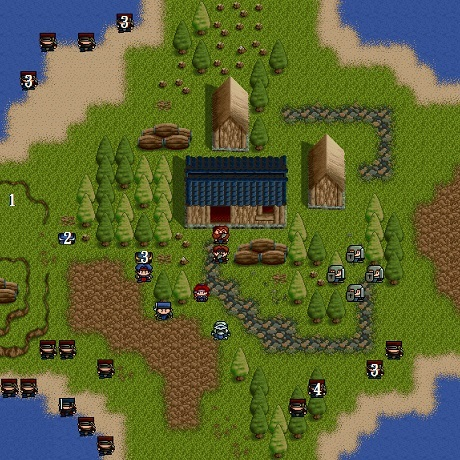

# 第一章 - 初試身手



1. 5000元
2. 3000元
3. 藥草
4. 1000元

## 敵方

* LV2盜賊x7（HP28,AP24,DP4,DX2,MV4）
* LV2盜賊x4
* LV3海盜頭目（HP72,AP34,DP11,DX6,MV4）
* LV2盜賊x4

## 友方

* LV2士兵x4（HP36,AP20,DP6,DX2,MV4）

## 勝利條件

敵全滅

## 失敗條件

索爾死亡

## 寶物

```
(0,10)→5000元（地圖左邊平台最上方） *
(3,12)→3000元
(7,13)→藥草
```

## 事件：

* 第三回合己方結束時，哈瓦特和他的兒子哈諾從房子出來幫忙。
* 第四回合己方結束時，四名敵方援軍出現在右下角。
* 第五回合己方結束時，海盜頭目帶著四名屬下出現在左下角。
* 第六回合己方結束時，四名海防隊員從右上角出來幫忙並立即行動。
* 如果哈諾在戰鬥中不幸陣亡，原本可以控制的哈瓦特會暴走。

## 說明

哈諾要練等，哈瓦特就不用了。記得將哈瓦特的裝備移出來到商店賣錢。

## 加入

戰士哈諾

## 備註

若哈諾還未出現便已消滅完敵人，那麼哈諾便不會加入了。

[上一頁](FORMULA.md) / [下一頁](2.md)
