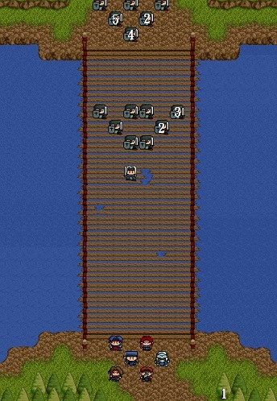

# 第三章 - 往塞拉村途中

## 備註

第二章撿到的旅行裝先別賣掉，第四章可給鐵諾用。

## 武器店

```
短劍      AP10   $50
闊劍      AP20   $250
手斧      AP20   $300
皮甲      DP8    $300
法師袍    DP12   $750
```

## 道具店：

```
藥草      HP40   $10
```

神秘商店 (武器店前按 `Ctrl` + `F2` 鍵)

```
回復劑    HP120  $80
魔法水    MP80   $1000
```

## 地圖



1. 長弓
2. 藥草
3. 綠寶石
4. 2000元
5. 1500元


1. 藥草

## 敵方

* LV3士兵x8（HP42,AP35,DP14,DX3,MV4）
* LV5精英戰士（HP90,AP60,DP30,DX10,MV4）
* LV3士兵x5
* LV3士兵x6

## 勝利條件

敵全滅

## 失敗條件

索爾死亡

## 寶物

```
*(14,25)→長弓（地圖右下方第一棵樹的樹幹）
```

## 事件

* 第三回合開始時，敵方首領及援軍出現在橋的兩端。

## 說明

兵分兩路，索爾及亞雷斯前去幫助鐵諾，其他人則利用地形擋住下方的敵人。長弓先別急著叫希莉亞拿，不然會被敵方援軍堵死。

## 加入

劍士鐵諾若未死時加入
