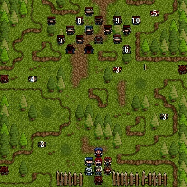

# 第四章 - 塞拉村前

## 備註

如果前幾章練功夠，錢也足夠時，本章最好別置裝，改購買風精之羽。

## 武器店

```
闊劍      AP20   $250
迴旋斧    AP35   $800
長弓      AP40   $500
釘頭鎚    AP25   $180
旅行裝    DP10   $500
皮甲      DP8    $300
硬皮甲    DP15   $800
法師袍    DP12   $750
```

## 道具店

```
藥草      HP40   $10
回復劑    HP120  $80
```

## 神秘商店 (出口前按 `Alt` + `F3` 鍵)

```
風精之羽  MV+1   $20000
魔法水    MP80   $1000
```

## 地圖



1. 力量藥水
2. 綠寶石
3. 藥草
4. 闊劍
5. 風精之羽
6. 回復劑
7. 魔法水
8. 紅寶石
9. 短劍
10. 綠寶石

## 敵方

* LV6盜賊頭目（HP144,AP68,DP33,DX12,MV4）
* LV5盜賊x12（HP70,AP55,DP13,DX5,MV4）
* LV3僧侶x2（HP36,MP12,AP40,DP18,DX3,MV3,治療術）
* LV3魔法師x2（HP30,MP15,AP31,DP15,DX6,MV3,火炎術）
* LV6獸人x4（HP96,AP68,DP20,DX6,MV5）

## 勝利條件

敵全滅

## 失敗條件

索爾死亡

## 寶物

```
 (16, 1)→風精之羽
 (12, 7)→藥草
*(15, 7)→力量藥水（右上山丘最左下樹下方的碎石地）
 ( 3, 8)→闊劍
 ( 4,15)→綠寶石
 (17,12)→藥草
```

## 事件

第四回合己方結束時，四名獸人出現在四個角落，只要打死任何一個，其餘三個便會逃跑（被擋住也不會攻擊）。

## 說明

不太好打的一關，要利用地形佈陣在左下角防禦。別小看串場的獸人，他們一擊必殺的能力極強。若可以的話，留下一個祭司或獸人練功，並偷空去拿取寶物。
