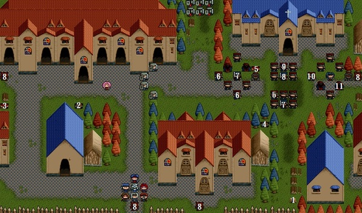

第五章 - 塞拉村

## 武器店

| 物品名 | 效果 | 價格 |
| -- | -- | -- |
| 闊劍 | AP20 | $250 |
| 長劍 | AP40 | $800 |
| 刺矛 | AP20 | $80 |
| 騎槍 |  AP28 | $400 |
| 硬皮甲 | DP15 | $800 |
| 環狀甲 | DP24 | $1000 |

## 道具店：

```
藥草      HP40   $10
回復劑    HP120  $80
解毒劑    解毒   $20
```

## 神秘商店：道具店前按 `Shift` + `F4` 鍵

```
力量藥水  AP+9   $10000
耐力藥水  DP+9   $10000
速度藥水  DX+7   $10000
生命之實  MHP+20 $10000
```

## 地圖



1. 淬毒刀
2. 長劍
3. 力量藥水
4. 10000元
5. 回復劑
6. 解毒劑
7. 5000元
8. 紅寶石
9. 2000元
10. 1000元
11. 綠寶石

## 敵方

* LV8卡特那（HP240,AP90,DP39,DX16,MV4）
* LV7盜賊頭目x3（HP168,AP76,DP36,DX14,MV4）
* LV7盜賊x20（HP98,AP69,DP22,DX7,MV4）
* LV7僧侶x2（HP84,MP28,AP60,DP26,DX7,MV3,治療術）
* LV6魔法師x2（HP60,MP30,AP37,DP18,DX12,MV3,火炎術）
* LV6魔法師x2（HP60,MP30,AP37,DP18,DX12,MV3,火炎術,電擊術）
* LV7獸人x4（HP112,AP76,DP29,DX7,MV5）

## 友方

* LV7士兵x4（HP126,AP55,DP29,DX7,MV4）
* LV7騎兵x6（HP140,AP84,DP22,DX7,MV7）

## 勝利條件

消滅卡特那

## 失敗條件

索爾死亡

## 寶物

```
 (27, 7)→回復劑
 ( 8,11)→長劍
 ( 0,11)→力量藥水
*(31,21)→淬毒刀（在地圖右下方斷掉的樹幹）
 (28,13)→10000元
```

## 事件

* 第三回合己方結束時，敵方第二隊敵人開始行動。
* 第四回合己方結束時，己方支援部隊六名騎士出現在上方並開始行動，敵方也開始全員行動。
* 第七回合己方結束時，四名獸人出現在四個角落並行動，第八回合即撤退離開（身上各有一顆紅寶石）。

## 說明

鐵諾和亞雷斯走下邊，並拿取淬毒刀，其餘人往上和瑪琳會合。敵人身上有寶物的，要搶在支援部隊前打死他。

## 加入

僧侶瑪琳
